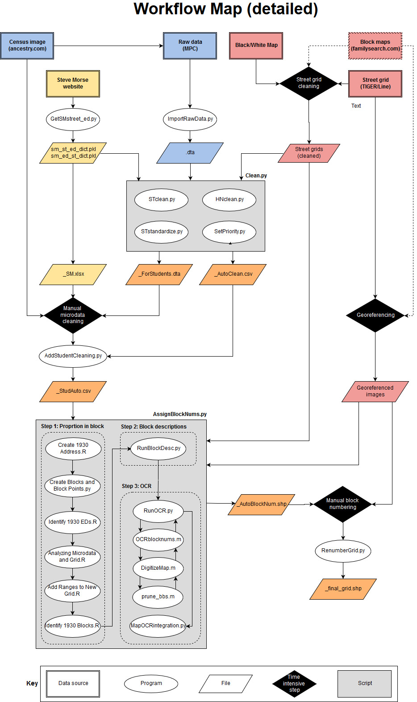

# hist-census-gis
<h1>Historical Census GIS project</h1>
<h2>Geocoding historical Census data by hook or by crook</h3>

This repository exists to serve as a place to share and collaboratively write code that automates various parts of a complicated data cleaning process.

<h3>Goals for each city</h3>
<ul type="1">
<li>Clean and validate digitized historical census records for 100% count data</li>
<li>Construct accurate historical street grid from modern TIGER/Line files</li>
<li>Label census block numbers for each physical city block</li>
<li>Update house number ranges to reflect historical ranges</li>
</ul>

Achieving these goals allows us to produce an historically accurate address locator for each city. With this address locator it is possible to geocode not only historical census data but also any other contemporary data that includes adddress information (e.g. tax data, death certificates, business locations, etc.).

<h3>Structure of project</h3>

This project consists of two broad tasks - microdata cleaning and block numbering. A third task is the creation of historically accurate street grids, but this work is relatively straightforward and, for the most part, cannot be automated.

Microdata cleaning and block numbering have been automated whenever possible. When we were not reasonably certain that automation would produce 100% accurate results we relied on manual processes that have been refined over the course of the project.

</img>

Please Contact <a href="mailto:christopher_graziul@brown.edu">christopher_graziul@brown.edu</a> if you have any questions.

